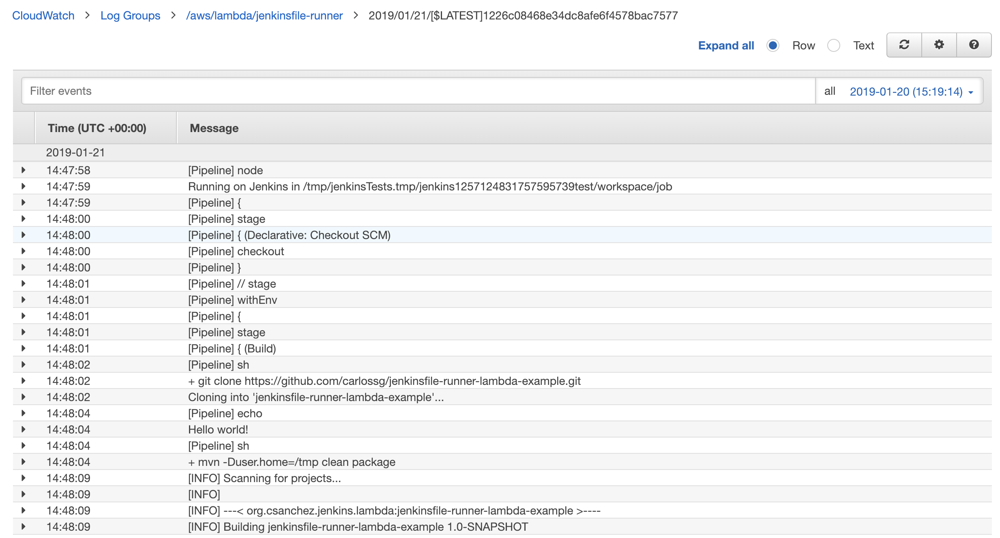

# Jenkinsfile Runner for AWS Lambda

</img>

An AWS Lambda function to run Jenkins pipelines. It will process a GitHub webhook, git clone the repository and execute the Jenkinsfile in that git repository.
It allows huge scalability with 1000+ concurrent builds and pay per use with zero cost if not used.

This function allows `Jenkinsfile` execution without needing a persistent Jenkins master running in the same way as [Jenkins X Serverless](https://medium.com/@jdrawlings/serverless-jenkins-with-jenkins-x-9134cbfe6870), but using AWS Lambda instead of Kubernetes.
All the logs are stored in AWS CloudWatch and are easily accessible.



# Why???

Why not?

I mean, it could make sense to run Jenkinsfiles in Lambda when you are building AWS related stuff, like creating an artifact and uploading it to S3.

# Limitations

Lambda limitations:

* 15 minutes execution time
* 3008MB of memory
* git clone and generated artifacts must fit in the 500MB provided

Current implementation limitations:

* `checkout scm` does not work, change it to `sh 'git clone https://github.com/carlossg/jenkinsfile-runner-lambda-example.git'`
* Jenkinsfile must add `/usr/local/bin` to `PATH` and use `/tmp` for any tool that needs writing files, see the [example](https://github.com/carlossg/jenkinsfile-runner-lambda-example)

# Example

See the [jenkinsfile-runner-lambda-example] project for an example that is tested and works.(https://github.com/carlossg/jenkinsfile-runner-lambda-example)

# Extending

Three lambda layers are created:

* jenkinsfile-runner: the main library
* plugins: minimal set of plugins to build a `Jenkinsfile`
* tools: git, openjdk, maven

You can add your plugins in a new layer as a zip file inside a `plugins` dir to be expanded in `/opt/plugins`.
You could also add the Configuration as Code plugin and configure the [Artifact Manager S3](https://plugins.jenkins.io/artifact-manager-s3) to store all your artifacts in S3.

Other tools can be added as new layers, and they will be expanded in `/opt`. You can find a list of scripts for inspiration in the [lambci project](https://github.com/lambci/lambci/tree/master/home/init) (gcc,go,java,php,python,ruby,rust) and [bash, git and zip](https://github.com/lambci/lambci/tree/master/build) (git is already included in the `tools` layer here)

The layers are built with Docker, installing `jenkinsfile-runner`, tools and plugins under `/opt` which is where Lambda layers are expanded. These files are then zipped for upload to Lambda.

# Installation

Create a lambda function `jenkinsfile-runner` using `Java 8` runtime.
Use the layers built in `target/layer-*` and `target/jenkinsfile-runner-lambda-*.jar` as function. Could use `make publish` to create them.

Set 

* handler: `org.csanchez.jenkins.lambda.Handler::handleRequest`
* memory: 1024MB
* timeout: 15 minutes

```
aws lambda create-function \
    --function-name jenkinsfile-runner \
    --handler org.csanchez.jenkins.lambda.Handler::handleRequest \
    --zip-file fileb://target/jenkinsfile-runner-lambda-1.0-SNAPSHOT.jar \
    --runtime java8 \
    --region us-east-1 \
    --timeout 900 \
    --memory-size 1024 \
    --layers output/layers.json
```

## Exposing the Lambda Function

From the lambda function configuration page add a API Gateway trigger. Select `Create a new API` and choose the security level. Save the function and you will get a http API endpoint.

Note that to achieve asynchronous execution (GitHub webhooks execution will time out if your webhook takes too long) you would need to configure API Gateway to send the payload to SNS and then lambda to listen to SNS events. See [an example](https://stackoverflow.com/questions/34213464/aws-api-gateway-communicating-to-sns).

## GitHub events

Add a GitHub `json` webhook to your git repo pointing to the lambda api gateway url.

# Building

    make

# Publishing

Once the lambda function `jenkinsfile-runner` is created

    make publish

# Development

    docker build -t csanchez/jenkinsfile-runner-lambda .
    docker run -ti --rm -v `pwd`/demo:/workspace -w /workspace csanchez/jenkinsfile-runner-lambda

# Testing

    curl -v -H "Content-Type: application/json" --data '@src/test/resources/github.json' https://AAAABBBBCCCC.execute-api.us-east-1.amazonaws.com/default/jenkinsfile-runner

Getting the logs

    awslogs get /aws/lambda/jenkinsfile-runner ALL --watch
